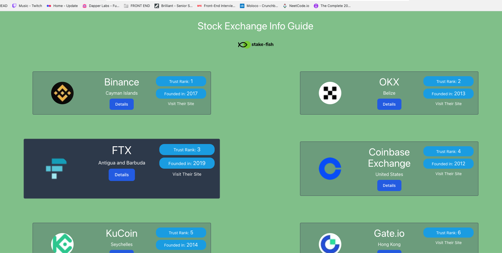
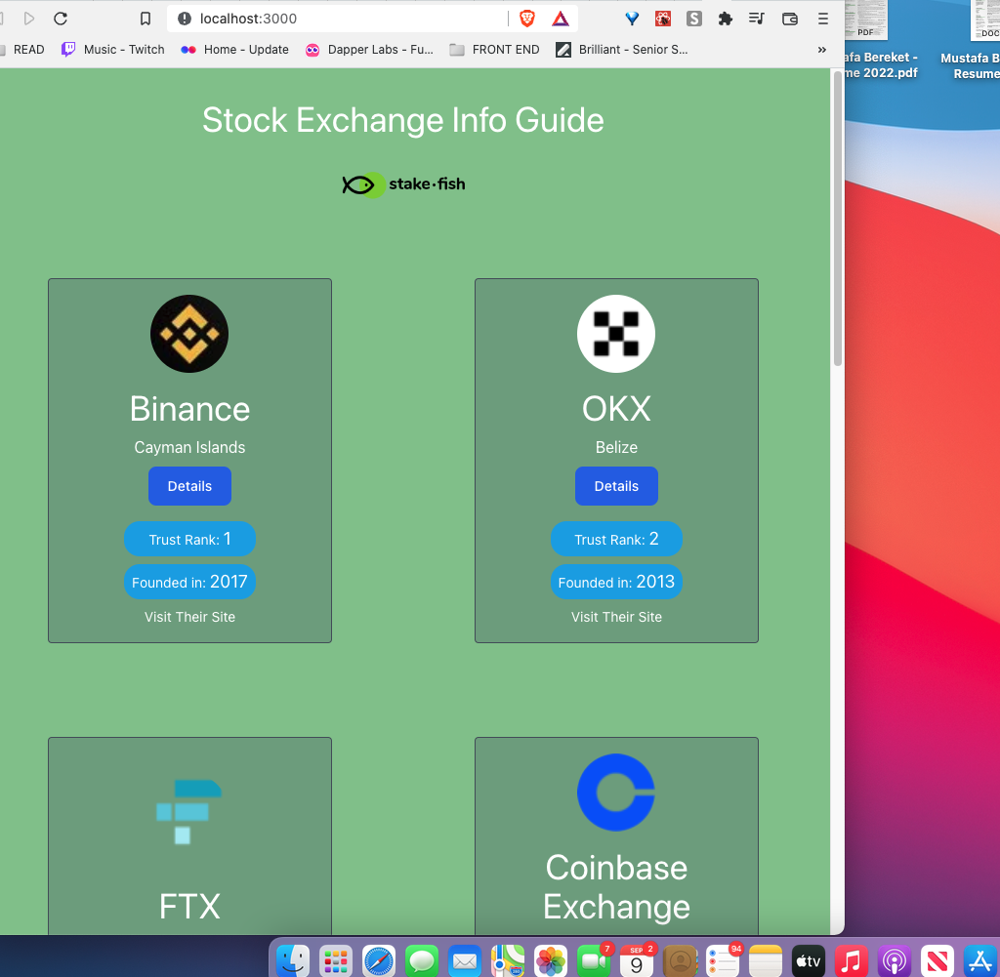
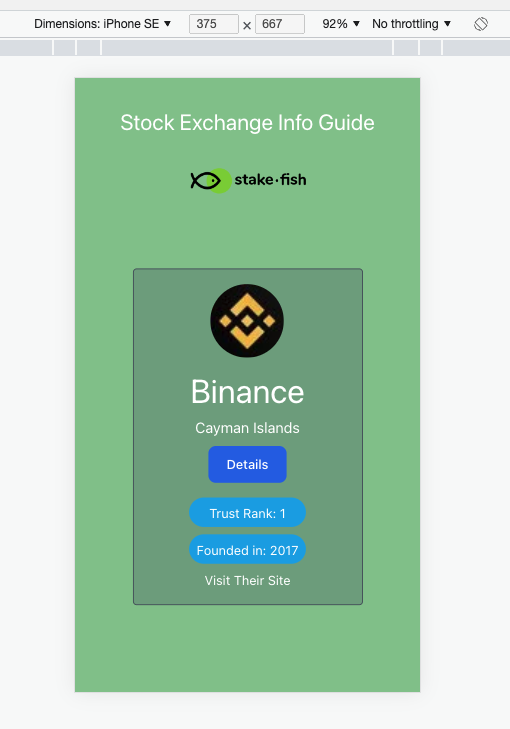

# stock-exchange-guide

## How To
Clone the repo and cd into it

```npm install```

```npm start```


## Notes
- Used React with TypeScript
- Used TailWind for styling
- Used new react router (v6)
- Tried to make it as mobile friendly as possible
- Did not add pagination nor tests due to time restrictions


## Screen Shots


